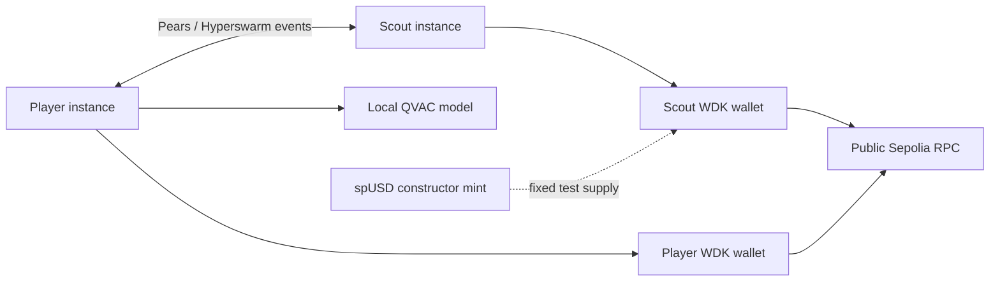
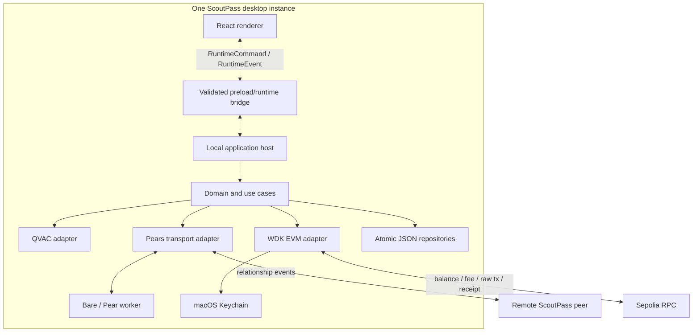
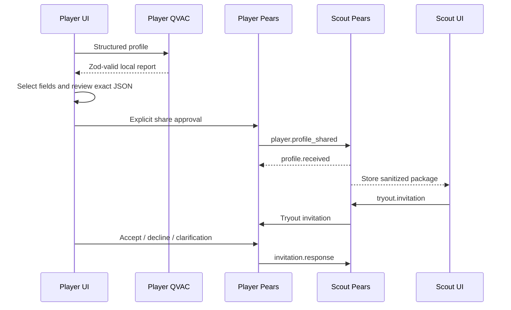
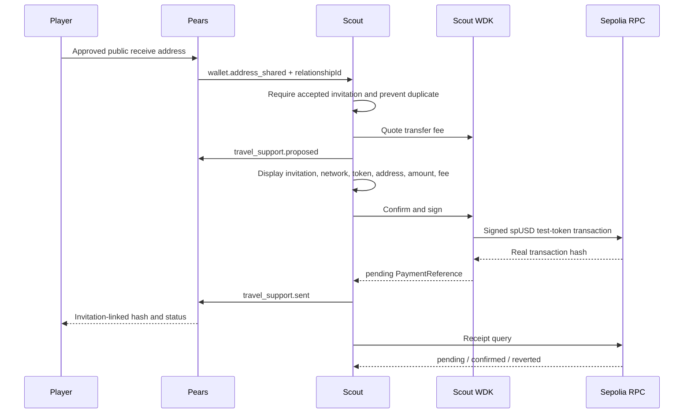

# ScoutPass architecture

## System context

ScoutPass has no central application server. Player and Scout instances communicate directly; QVAC
inference and normal storage are local, while WDK uses public Sepolia infrastructure for blockchain
operations.

## Containers

The packaged Electron app installs `window.scoutpassRuntime` from a sandboxed preload. Every command
is validated in the renderer bridge and Electron main, accepted by the Bare worker, recorded as
sanitized metadata in Corestore/Hypercore, and then dispatched to the local command handler. The
returned event is validated, recorded by the worker, and returned to the renderer. The Vite browser
shell remains a UI-only development surface.

## Component ownership

| Component                 | Responsibility                                                     | Must not do                                         |
| ------------------------- | ------------------------------------------------------------------ | --------------------------------------------------- |
| `frontend/src`            | Role workflows, exact previews, explicit approvals, status display | Read Keychain, import native SDKs, open P2P sockets |
| `backend/src/domain`      | Models, schemas, state transitions, money/event rules              | Import QVAC, Pears, or WDK SDKs                     |
| `backend/src/application` | Use cases and adapter/repository ports                             | Store recovery material or bypass approval checks   |
| `infrastructure/qvac`     | Local prompt, model lifecycle, response parsing                    | Call hosted AI or fabricate a report                |
| `infrastructure/pears`    | Invite topics, Hyperswarm connection, framed bytes                 | Trust unvalidated peer bytes                        |
| `infrastructure/wdk`      | Keychain-backed WDK account, balance, quote, transfer, receipt     | Return seed/private key to UI or normal storage     |
| `infrastructure/storage`  | Isolated strict JSON state and atomic writes                       | Silently replace corrupt/unknown-version state      |

## Profile and invitation flow

## Travel-support flow

## Persistence

Each role resolves to a separate data file under `SCOUTPASS_DATA_DIR/<role>/`. Writes validate the
complete state, write an owner-only temporary file, then atomically rename it. Relationship events are
append-only and event IDs are deduplicated.

The Pear worker owns a separate named Corestore feed for IPC audit metadata. Records contain only the
request ID, command/event type, timestamp, and record kind. Hypercore supplies append-only storage;
Autobase is not used because this local audit feed has no multi-writer merge requirement.

Wallet recovery material uses the `io.scoutpass.wallet` macOS Keychain service and never appears in
the JSON state. Clearing app data intentionally leaves Keychain material untouched.

## Protocol constraints

- Protocol version: `1.0.0`
- Local schema version: `1.0.0`
- Maximum P2P event payload: 64 KiB
- Event union: profile share/receipt, invitation/response, wallet address, payment proposal/result
- Time storage: ISO 8601 UTC; UI rendering uses the local locale

Detailed process and storage decisions are in [ADR 0001](decisions/0001-desktop-process-boundaries.md)
and [ADR 0002](decisions/0002-local-storage.md).
